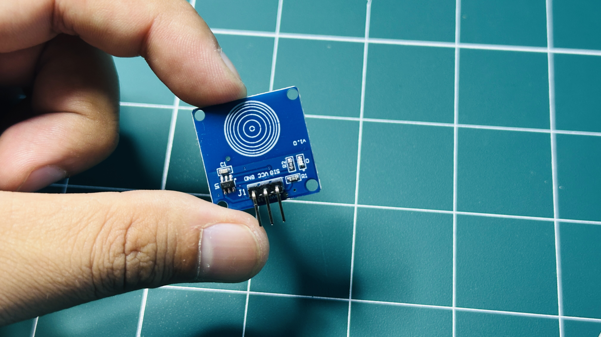
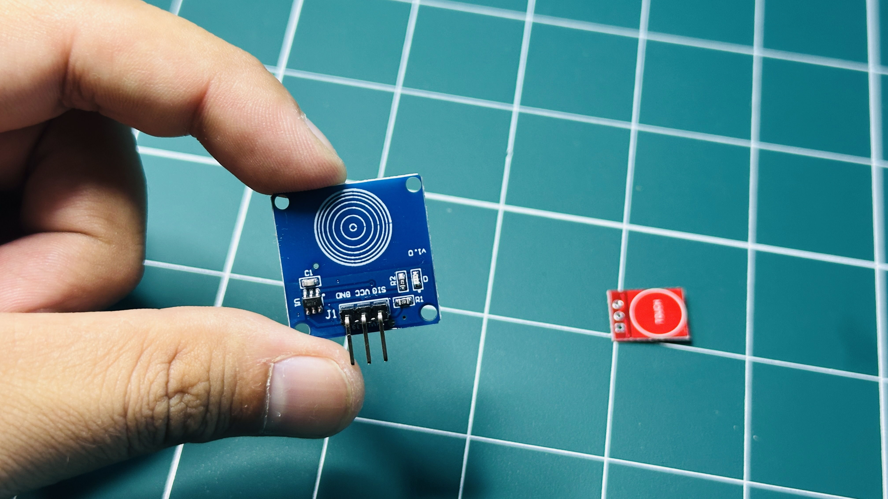
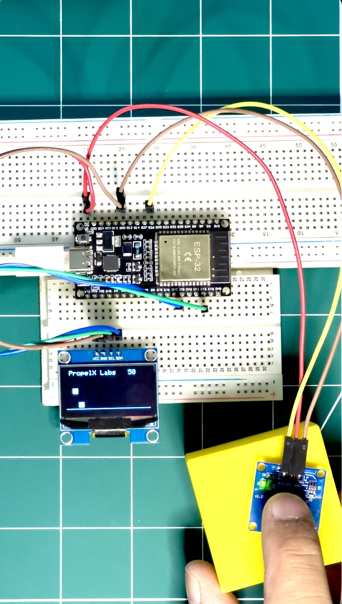

# PropelX Labs | Sensor Sunday - 0002

## TTP223 – Capacitive Touch Sensor Module

From **touch buttons** in appliances to **interactive art installations**, the **TTP223 capacitive touch sensor** brings a sleek, modern way to detect human touch — no moving parts, just pure capacitive magic ✨👆

The **TTP223** detects changes in capacitance when a finger approaches or touches its surface. That means you can build **touch-activated switches** that are durable, responsive, and stylish — much like the invisible buttons you tap on modern devices.

The **TTP223** is widely used in:

- **Touch-activated switches**
- **Home automation systems**
- **Wearable devices**
- **Interactive DIY projects**
- **Consumer electronics** that rely on clean, button-less interfaces

The module offers **single-key capacitive sensing** with several configuration options:

- **Digital output (D0)** goes **HIGH or LOW** depending on touch status.
- Supports **momentary** or **toggle** output modes (via onboard solder pads).
- Configurable features like **active HIGH/LOW**, **fast/slow response**, and **low-power mode**.

This makes the TTP223 ideal for **touch lamps**, **smart switches**, **hidden buttons**, and all kinds of **minimal, futuristic interfaces**.

---

## Hardware Connections

---

## 🔧 Hardware Used

1. **ESP32 (38 Pin)** – Reads the sensor output and drives the on-screen feedback.
2. **OLED Display** – Shows live touch state information.
3. **TTP223 Capacitive Touch Sensor** – The star of this build! A compact and reliable capacitive touch detector.

---

## 💻 Code & Resources

Project repository:  
👉 _Coming soon to PropelX Labs GitHub!_ 🚀  
(Replace this with your repo link when ready.)

Includes:

- Wiring guide ✋⚡
- ESP32 example code
- Optional OLED visualization

---

See the TTP223 in action this **Sensor Sunday** with **PropelX Labs!**  
Bring intuitive, human-friendly touch interaction to your next project 🌟🔌

---

**#PropelXLabs #SensorSunday  
#TTP223 #CapacitiveTouch  
#MakerCommunity #DIYTech  
#Innovation #STEM  
#IoTProjects #EmbeddedSystems**
